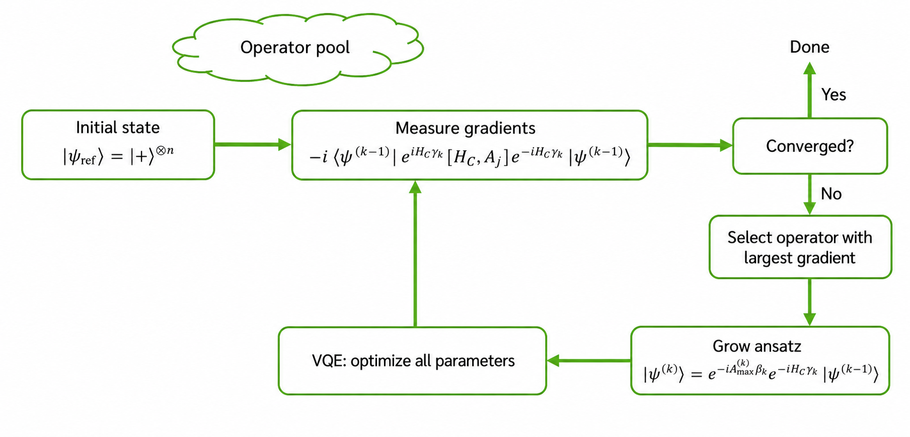

# Parallelizing ADAPT-QAOA with CUDA-Q

In this exercise, an AI agent has already written a baseline CUDA-Q ADAPT-QAOA
implementation for you. Your job is to start with the provided tests to
validate it, write new tests to extend your coverage, then build on the
implementation — practicing the same workflow you'd use in real agentic
development. The algorithm is depicted below if you're unfamiliar with
ADAPT-QAOA.

> **Data note:** We will collect the saved AI chat conversations, exercise
> files, and results from this exercise. Do not include personal data,
> credentials, private keys, or other sensitive information in prompts, files,
> notes, benchmark outputs, or saved conversations.

The exercise folder contains:

| Path | Purpose |
| --- | --- |
| `README.md` | Exercise instructions. |
| `maxcut_instances/` | [QED-C](https://github.com/SRI-International/QC-App-Oriented-Benchmarks) MaxCut problem files and matching solution files. |
| `adapt_qaoa.py` | Baseline ADAPT-QAOA implementation, adapted from the [CUDA-Q ADAPT-QAOA example](https://nvidia.github.io/cuda-quantum/latest/applications/python/adapt_qaoa.html). |
| `parallel_adapt_qaoa.py` | Starting point for the parallel implementation. It begins as a copy of `adapt_qaoa.py`. |
| `run_qedc_input.py` | Runner for loading and solving QED-C MaxCut inputs. |
| `tests/` | Tests from the AI-assisted refactor that verify the baseline implementation and QED-C input handling. |

Use the checkboxes as a printed worksheet or as a lightweight progress tracker
while you work through the exercise.

## 0. Personalize Your Agent

Before starting, consider updating your `USER.md` file to tell the AI agent how
you want explanations and conversations to work during this exercise. For
example, you can describe your background with Python, CUDA-Q, quantum
algorithms, GPUs, or testing, and ask the agent to match that level when it
explains code or asks follow-up questions.

**Checklist: 5 minutes**

- ☐ **Update `USER.md`.** Add or revise instructions that help the agent tailor
  explanations, pacing, and collaboration style to you. If you make edits, restart Codex.

## 1. Understand the Baseline

When working with new code, the first step is to understand it as well as you
can. AI is a useful tool for doing this efficiently. Complete the following
tasks to understand what you are starting with.

**Checklist: 10-15 minutes**

- ☐ **Understand the implementation.** Prompt AI to explain the general
  structure of `adapt_qaoa.py` in a way tailored to your experience with
  Python, CUDA-Q, QAOA, and variational algorithms. Focus on what the key
  functions do and what the user controls.

- ☐ **Run the baseline.** Run the script to make sure it works and produces the
  expected output for the default provided QED-C `mc_008_005` graph instance
  (`008` means 8 graph vertices/qubits, and `005` means the QED-C instance is
  5-regular, with 20 edges total).

- ☐ **Survey the tests.** When AI was used to refactor the code and add
  QED-C problem inputs, it used a team of agents to write some tests it needed
  to pass. Use AI to survey these tests. Do any of them test for
  quantum-specific properties?

## 2. Prepare Quantum-Specific Tests

When using AI to modify or create code, prepare tests that verify the model's
output and guard against breaking changes. In this section, use AI to plan and
write tests before modifying the implementation.

**Checklist: 15-20 minutes**

- ☐ **Brainstorm quantum-specific tests.** With a neighbor, use your quantum
  domain knowledge to think of a few tests that verify some of ADAPT-QAOA's
  quantum properties. For example, a test for standard QAOA might confirm that
  setting all parameters to zero produces an equal superposition.

- ☐ **Compare ideas with an AI tool.** Share your ideas with an AI tool and ask
  it to suggest tests you might have missed.

- ☐ **Select one test.** Choose the test that gives the most useful protection
  against a quantum-specific regression. Consider whether it checks algorithm
  correctness, circuit behavior, optimization behavior, or QED-C input handling.
  You can ask AI to help compare the candidates, then converse with AI until you
  have a clear plan for the test logic and verification criteria.

- ☐ **Save the test plan.** Ask AI to summarize the agreed test logic,
  verification criteria, and why this test is worth implementing. Save that
  summary as a Markdown file in this exercise folder so you can return to it
  during implementation and review.

- ☐ **Implement the test.** Prompt AI to add the test to the existing test file and
  confirm that the original code passes. Ask it to simultaneously launch a supervisory subagent
  to verify that the test follows the plan and that the test-writing agent does
  not weaken the test just to make the code pass. In the prompt, ask it to
  report what critiques the supervisor suggested to the test writer. **Share which test you chose** Respond on Mentimeter with the test you are currently implementing.

- ☐ **Review the test.** Confirm through human review that the test is valid
  before moving on.

## 3. Plan and Implement Parallel ADAPT-QAOA

CUDA-Q enables researchers to write accelerated hybrid algorithms and to scale
them across multiple GPUs. In this section, you will practice parallelizing code
with CUDA-Q while using CUDA-Q skills, effective planning, and multiple
subagents working in parallel.

You will run this work in NVIDIA Brev on a machine with 4 T4 GPUs. Plan your
implementation and benchmarks to use all available GPUs, not just a single GPU.

Use `parallel_adapt_qaoa.py` for the parallel implementation. It starts
identical to `adapt_qaoa.py` so you can compare the final parallel version
against the baseline.

**Checklist: 20-30 minutes**

- ☐ **Research the CUDA-Q scaling options.** Point AI to the official CUDA-Q
  routing skill and ask it to explain which backend and APIs would be needed to
  make a parallel version of ADAPT-QAOA that runs on multiple QPUs. **Do not
  plan code changes yet.** This step is only for getting the right CUDA-Q
  knowledge into the AI context window.

- ☐ **Identify parallelization opportunities.** Ask AI to examine the
  ADAPT-QAOA code and suggest opportunities to parallelize with this backend.
  Have it rank the opportunities from most to least promising for a speedup.
  **Do not implement any code changes yet.**

- ☐ **Write a plan.** Select one opportunity and ask AI to write a brief
  planning document for modifying `parallel_adapt_qaoa.py`. Review the
  plan and confirm that it makes sense before implementing changes.

- ☐ **Plan the benchmark output.** Ask AI to add a benchmark plan to the
  planning document. The benchmark must run the default `mc_008_005` graph with
  ADAPT-QAOA iterations capped at 5, using 1, 2, 3, and 4 GPUs on the NVIDIA Brev
  machine. The benchmark should include the key information needed to demonstrate
  the speedup and clearly communicate the result as if you were sharing it with
  a colleague.

- ☐ **Divide the work across subagents.** Ask AI to examine the plan and
  suggest how to divide the coding, benchmark, and validation tasks across
  independent subagents without overlapping files. This is about organizing the
  AI-assisted development work; CUDA-Q handles GPU execution separately.

- ☐ **Execute the plan.** Implement the plan and determine whether the
  parallel version produces a speedup on the default `mc_008_005` graph when
  ADAPT-QAOA is capped at 5 iterations and run with 1, 2, 3, and 4 GPUs.

- ☐ **Share your results** Respond on Mentimeter with what you parallelized and what the speedup was for the 4 GPU case over a single GPU.

## 4. Reflect and Generalize

When using AI for coding, it is important to reflect on what went well and what did not.  Inefficient or frustrating experinces are always
opportunities to improve your workflow for next time. The experience is not
static; it depends heavily on evolving your planning, prompts, and context.

**Checklist: 20 minutes (As a group)**

- ☐ **Identify what went well.** Note which prompts, planning steps, tests, or
  agent behaviors helped you make progress.

- ☐ **Reflect on the workflow.** Consider where better prompting, planning, or
  custom skill files might have improved the outcome or efficiency of the
  exercise.

- ☐ **Look for reusable patterns.** Identify tasks that generalize beyond this
  specific problem.

- ☐ **Look for failure points.** Note where the model got stuck, performed
  poorly, or relied too heavily on agent autonomy when more human review would
  have helped.

- ☐ **Choose a skill idea.** Pick one reusable workflow improvement that could
  become a custom `SKILL.md` file.

- ☐ **Explore skill-building resources.** In Codex CLI, open `/plugins`, search
  for `superpowers`, and select **Install Plugin**. After restarting Codex, use
  the `writing-skills` skill to make a `SKILL.md` file. 

- ☐ **Share with the group.** Describe the skill you are building and why it
  would help in future coding work.

## 5. Share and Submit Your Work

Before you leave the exercise, save a copy of the work you want to keep and
submit the requested files.

**Checklist: 5 minutes**

- ☐ **Package the exercise folder.** Ask AI to create a zip file of the full
  `03_04_exercise_qaoa_and_adapt/` folder, including code, tests, benchmark
  outputs, plots or reports, planning notes, and saved conversations.

- ☐ **Download the zip file.** Use the Jupyter file browser to download the zip
  file so you have a local copy of your work.

- ☐ **Submit your work.** Submit the files by following the instructions in the
  resource guide.

## 6. Post-Workshop (Optional)

In this workshop, you applied an AI-assisted development workflow to a focused
example. The same process can generalize to your own work by building reusable
skills, setting up context files such as `USER.md` and `AGENTS.md`, and carefully
planning future code changes before implementation.

Outside the workshop, you can redo this exercise with a fresh file structure and
AI chat, but try using the
[Superpowers repository](https://github.com/obra/superpowers) to support
brainstorming, test-driven development, and multi-agent orchestration.

## Data Source

The MaxCut instances in `maxcut_instances/` are from QED-C's
[`SRI-International/QC-App-Oriented-Benchmarks`](https://github.com/SRI-International/QC-App-Oriented-Benchmarks)
quantum benchmark repository.

## Resources

- [NVIDIA CUDA-Q documentation](https://nvidia.github.io/cuda-quantum/latest/)
- [CUDA-Q ADAPT-QAOA example](https://nvidia.github.io/cuda-quantum/latest/applications/python/adapt_qaoa.html)
- [CUDA-Q multi-GPU workflows](https://nvidia.github.io/cuda-quantum/latest/using/examples/multi_gpu_workflows.html)
- [QED-C application-oriented benchmark repository](https://github.com/SRI-International/QC-App-Oriented-Benchmarks)
- [Superpowers plugin](https://github.com/obra/superpowers)
- [Superpowers skills repository](https://github.com/obra/superpowers-skills)
