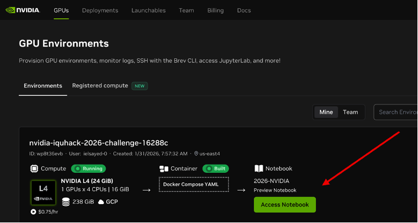

# Deploying the CUDA-Q 2026 Workshops Launchable on Brev

**Step 1:** Go to [http://brev.nvidia.com](http://brev.nvidia.com) and input your email to create an account.
- If it is your first time using Brev, create a new Brev organization by clicking on the building icon in the top right corner and selecting: **+Create a new organization**

**Step 3:** Go to the Billing tab
- **If you have a coupon code:**
    - Scroll down and click **Redeem Code.**
    - Please ensure coupon code is all lower case.
    - Click **Redeem**

        

- **If you do NOT have a coupon code:**
    - Input card information

**Step 4:** Click the **Deploy Now** Button or click [here](https://brev.nvidia.com/launchable/deploy/now?launchableID=env-3ArWtvLW8owzkxgR4Gcohy3qWip) to access the materials in the repository in a pre-configured GPU-environment
 
- Select **View All Options** to change your GPU/CPU selection based on the workshop.

| Workshop          | GPU/CPU Configuration      |
| :---------------- | :------: |
| QAOA for Max Cut          |   CPU or L4     |

 
 **Step 5:** After selecting compute configuration, click **Deploy Launchable**
 - You can check the status of your deployment by clicking **Go to Instance Page** or from the **GPUs** tab.

 **Step 6:** Once deployment is complete (~7-10 minutes), you will see a GPU environment under the GPUs tab with both stages green. 
 
 **Step 7:** Launch the workshop by selecting Access Notebook. If the status isn't green, refresh your browser or toggle to the GPU tab in the dashboard to verify the environment is ready.

