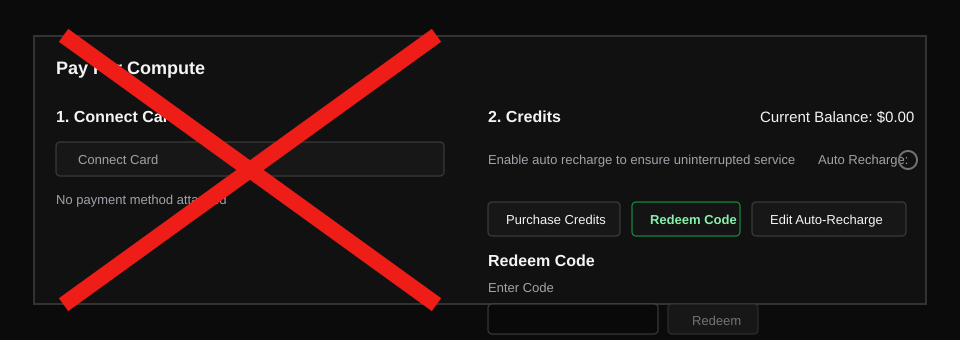
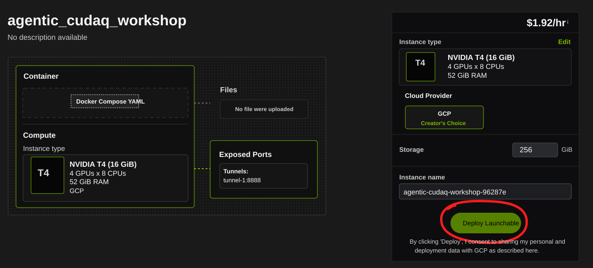
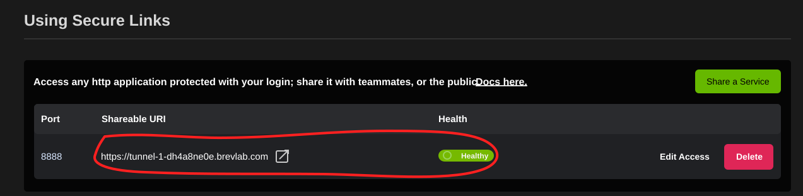
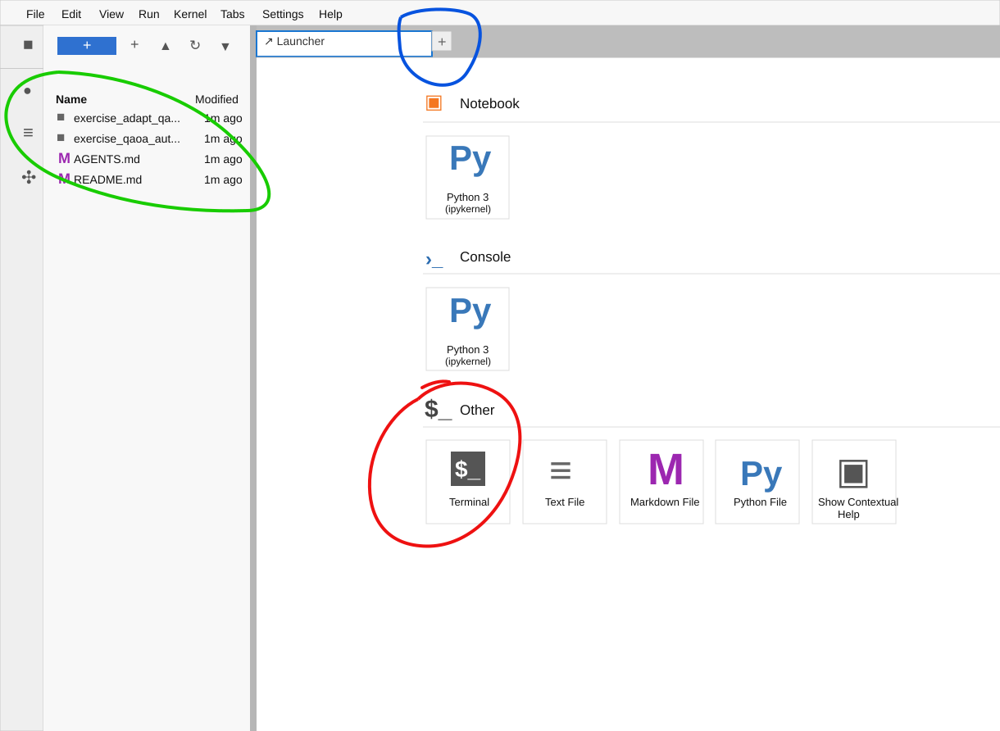
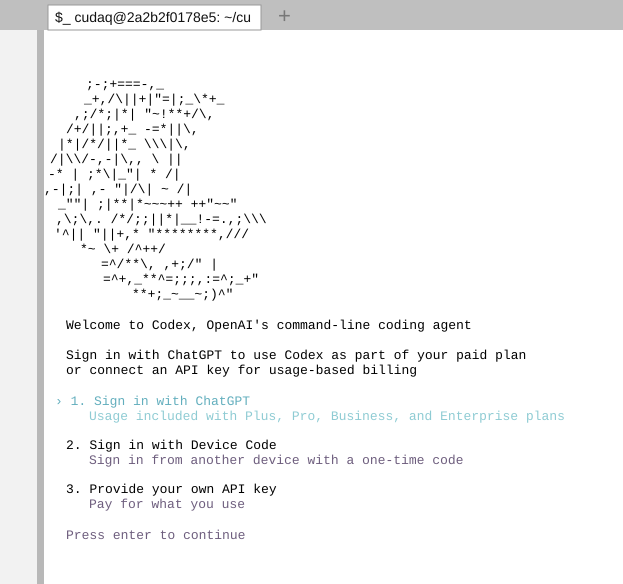
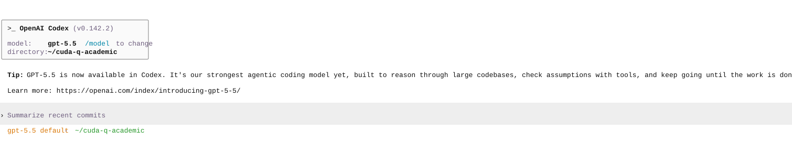
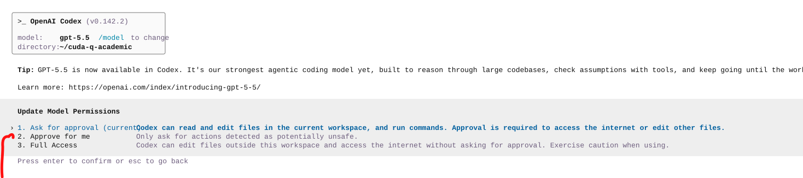

# Getting Set Up for the Workshop

## Setting Up Brev

1. Go to [brev.nvidia.com](https://brev.nvidia.com) and enter your email to create an account.

2. Create a new Brev organization by clicking the building icon in the top-right corner and selecting **+Create a new organization**.

   

3. Go to the **Billing** tab.

   

   **If you have a coupon code:**

   1. Scroll down and click **Redeem Code**.
   2. Enter the coupon code in all lowercase.
   3. Click **Redeem**.

   **If you do not have a coupon code:**

   1. Enter your card information.

4. Open the workshop launchable at
   [https://brev.nvidia.com/launchable/deploy/now?launchableID=env-3H6j5NCoMPIUNiBDPPokL4HLVTM](https://brev.nvidia.com/launchable/deploy/now?launchableID=env-3H6j5NCoMPIUNiBDPPokL4HLVTM)
   and click the green **Deploy Launchable** button.

   

5. As the deployment starts, a button will appear allowing you to
   **Go to Instance Page**. Click that button.

6. On the instance page, scroll down to **Using Secure Links**. Wait until the
   Health status says **Healthy**, then click the secure link for port `8888`.
   This may take a few minutes, and you may need to refresh the page.

   

7. The link opens Jupyter in your browser. On the left, the workshop files are
   already available. Click **Terminal** to open a terminal tab in this home
   directory. You can open more tabs for terminals or files by clicking the
   plus button.

   

## Setting Up Codex

1. The launchable comes with CUDA-Q and Codex CLI preinstalled in an
   environment with 4 T4 GPUs. To set up Codex CLI, enter `codex` in your
   terminal. You should see the Codex sign-in screen.

   

2. Sign in with whichever method is most appropriate for you. After signing in,
   press Enter through the intro prompts. You should arrive at the Codex CLI
   interface.

   

3. By default, Codex asks you to approve every action it performs. In an
   isolated environment like Brev, it is handy to set permissions to
   **Approve for me**. Codex will use AI to automatically approve low-risk
   commands, which makes the experience much faster. Enter `/permissions`,
   select **Approve for me**, and press Enter to confirm.

   

4. You are now ready to use Codex. For each exercise, launch Codex from that
   exercise's directory so it reads the local `AGENTS.md` file with priority.
   Throughout the workshop, open a new tab, open a new terminal, `cd` to the
   correct exercise directory, and then enter `codex` in that terminal.
