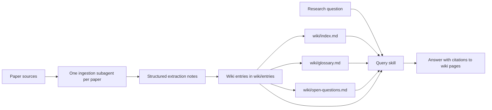

# Research Wiki LLM Workshop

This exercise demonstrates a local research wiki for quantum researchers. The
agent ingests papers, writes structured wiki pages, and answers questions with
citations to the wiki pages that contain the evidence.

This copy is intended to stay as the **blank participant wiki** until a
participant runs the ingestion workflow.

## Quick Start

1. Read [AGENTS.md](AGENTS.md) for the rules the agent must follow.
2. Check [documents/paper-sources.md](documents/paper-sources.md) for the demo
   paper list.
3. Ask Codex to build the wiki:

   ```text
   Read AGENTS.md. Use one subagent per paper to ingest every source listed in
   documents/paper-sources.md. Save the wiki entries, then update the index,
   glossary, and open questions. Do not create the optional comparison matrix.
   ```

4. Ask Codex to query the finished wiki:

   ```text
   Read AGENTS.md and answer the questions in prompts/demo-questions.md using only
   the local wiki. Cite the wiki pages that support each answer.
   ```

No Python package installation is required for the blank exercise itself. The
workflow depends on Codex reading the local instructions and skills in this
folder, then fetching the paper sources during ingestion.

## Where To Look

- Start with [AGENTS.md](AGENTS.md) for the ground rules and demo commands.
- Use [documents/paper-sources.md](documents/paper-sources.md) to change which
  papers are ingested.
- Use [prompts/demo-questions.md](prompts/demo-questions.md) for the before and
  after query demo.
- See [skills/](skills/) for the local workflows that ingest papers, write wiki
  entries, and answer questions from the wiki.
- Generated wiki pages go in [wiki/entries/](wiki/entries/).
- The main generated navigation files are [wiki/index.md](wiki/index.md),
  [wiki/glossary.md](wiki/glossary.md), and
  [wiki/open-questions.md](wiki/open-questions.md).

## LLM-Wiki Structure

This exercise uses a local Markdown wiki as the agent's trusted knowledge base.
The paper list in [documents/paper-sources.md](documents/paper-sources.md)
defines what evidence is available. The local skills in [skills/](skills/)
turn those sources into structured pages under [wiki/entries/](wiki/entries/),
then keep the index, glossary, and open-question files current.

When the wiki is blank, the agent should say it lacks local evidence. After
ingestion, the same questions should produce grounded answers with citations to
the wiki pages that contain the supporting evidence.

## Flow



## Folder Layout

```text
AGENTS.md
documents/
  paper-sources.md
prompts/
  build-complete-wiki.md
  demo-questions.md
  optional-comparison-matrix.md
skills/
  ingest-research-paper/
  query-research-wiki/
  write-wiki-entry/
wiki/
  index.md
  glossary.md
  open-questions.md
  entries/
```

## Skills

### `ingest-research-paper`

Reads a paper, article, PDF text export, technical report, or lab note and
extracts the information needed for a durable wiki entry. It focuses on the
problem, method, evidence, results, limits, reusable terms, and open questions.

### `write-wiki-entry`

Turns extracted notes into a structured Markdown page under `wiki/entries/`.
The entry preserves provenance, captures key claims, records limitations, and
adds tags useful for later retrieval.

### `query-research-wiki`

Answers questions using the local wiki only. It must cite the wiki pages that
support the answer. If the wiki does not contain enough evidence, it must say so
instead of filling gaps from general model knowledge.

## Build A Wiki

From this folder, ask Codex:

```text
Read AGENTS.md. Use one subagent per paper to ingest every source listed in
documents/paper-sources.md. Save the wiki entries, then update the index,
glossary, and open questions. Do not create the optional comparison matrix.
```

The ingestion skill is set up to prefer arXiv HTML pages when available and to
fall back to PDF only when HTML is missing or incomplete.

## Add Papers Later

To add one paper after the initial wiki has been built, ask Codex:

```text
Work in demos_wiki_llm.

Read AGENTS.md. Add this paper to the research wiki:

<title or URL here>

Use skills/ingest-research-paper, then skills/write-wiki-entry. Prefer HTML
when available; fall back to PDF only if needed.

Create one new page under wiki/entries/, then update wiki/index.md,
wiki/glossary.md, and wiki/open-questions.md. Do not rewrite existing entries
unless the new paper requires a small cross-reference or glossary update.

When finished, tell me the new wiki page path and what changed in the
index/glossary/open questions.
```

To add several papers, ask Codex:

```text
Work in demos_wiki_llm.

Read AGENTS.md. Add the following papers to the research wiki:

1. <paper URL or local path>
2. <paper URL or local path>
3. <paper URL or local path>

Use one subagent per paper if available. Each subagent should use
skills/ingest-research-paper and produce extraction notes. Then write one wiki
entry per paper with skills/write-wiki-entry.

After all entries are created, update wiki/index.md, wiki/glossary.md, and
wiki/open-questions.md. Do not create wiki/comparison-matrix.md.

When finished, summarize the new entries, major new concepts, and any
unresolved ingestion issues.
```

After ingestion, try:

```text
Read AGENTS.md and answer the questions in prompts/demo-questions.md using only
the local wiki. Cite the wiki pages that support each answer.
```

## Optional Customization

Researchers can adapt the entry template with fields like `hardware`,
`backend`, `qubit_count`, `algorithm`, `problem_class`, `dataset`,
`evidence_strength`, `reproducibility`, or `lab_relevance`.

Possible add-ons:

- Build `wiki/comparison-matrix.md` from the optional prompt.
- Connect to arXiv, Semantic Scholar, Zotero, or a lab paper folder.
- Publish selected wiki summaries to Slack, Outlook, Teams, Notion, or Obsidian.
- Add a reviewer skill that flags weak evidence, missing baselines, or claims
  that do not trace back to source documents.

## Inspiration

This exercise is inspired by Andrej Karpathy's
[LLM Wiki](https://gist.github.com/karpathy/442a6bf555914893e9891c11519de94f)
pattern for LLM-maintained Markdown knowledge bases.
