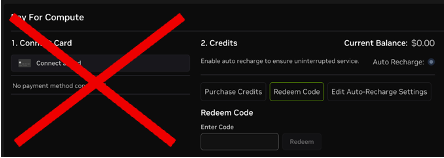

# Deploying the CUDA-Q 2026 Workshops Launchable on Brev

**Step 1:** Go to [http://brev.nvidia.com](http://brev.nvidia.com) and input your email to create an account. 

**Step 2:** Create a new Brev organization by clicking on the building icon in the top right corner and selecting: **+Create a new organization** 

**Step 3:** Go to the Billing tab

**Step 4:** Click the  Button or click here to access the materials in the repository in a pre-configured GPU-environment
 
If you don’t want to use the recommended L4, select View All Options to change your GPU selection.
 
 **Step 5:** After selecting GPU configuration, click Deploy Launchable
 •	You can check the status of your deployment by clicking Go to Instance Page or from the GPUs tab.
 
 **Step 6:** Once deployment is complete (~7 minutes), you will see a GPU environment under the GPUs tab with both stages green. 
 
 **Step 7:** Select Access Notebook to pull up the environment and start running notebooks in CUDA-Q Academic!
 